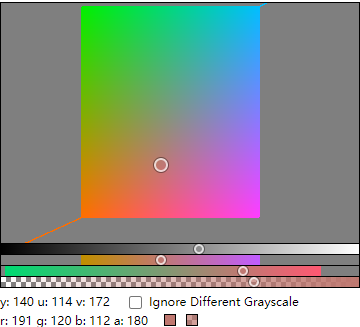
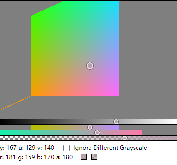

# YUV Color Picker

## Introduction
YUV color picker implemented with webgpu. 

It shows colors with the same grayscale value. You can enable "ignore different grayscale" to see the original YUV color plane. This color picker might be helpful to those like me who struggle with selecting colors during their painting.




## Note
You'd need a browser like chrome or edge that support webgpu. 

## Installation

```sh
$ npm i yuv-color-picker
```

## Usage

```html
<!-- in your html -->
<div id="picker-container"></div>
```

```jsx
/* in your js script */
import YUVColorPicker from 'yuv-color-picker';

const picker = new YUVColorPicker({
    
    /* necessary */
    container: document.getElementById('picker-container'),
    ignore_different_grayscale: false,
    show_info: true,
    
    
    /* optional (uncomment the following if needed) */
    //different_grayscale_tolerance: 1e-3, //default: 1e-3; recommend 1e-2 or 1e-3
    //wrapper_background_color: 'antiquewhite', //default: none;
    //wrapper_padding: 15, //default: 0;

    canvas_width: 360, //default: 300;
    canvas_height: 240, //default: 150;
    //color_component_height: 15, //default: 10;

    // yuv_y: 160, //default: 128;
    // yuv_u: 100, //default: 93;
    // yuv_v: 50, //default: 200;
    // a: 200, //alpha, default: 180;
    

});

//get color values:
console.log("picker.rgb_r", picker.rgb_r);
console.log("picker.rgb_g", picker.rgb_g);
console.log("picker.rgb_b", picker.rgb_b);

console.log("picker.yuv_y", picker.yuv_y);
console.log("picker.yuv_u", picker.yuv_u);
console.log("picker.yuv_v", picker.yuv_v);
console.log("picker.a", picker.a);

```


License
----
MIT
